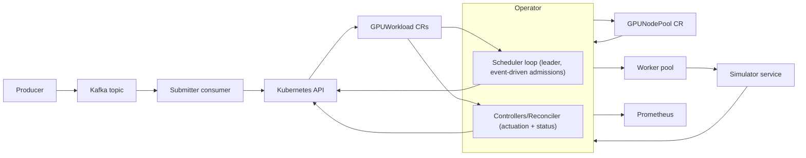
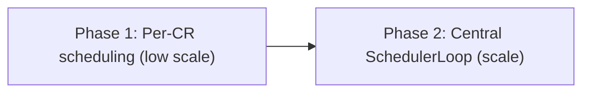
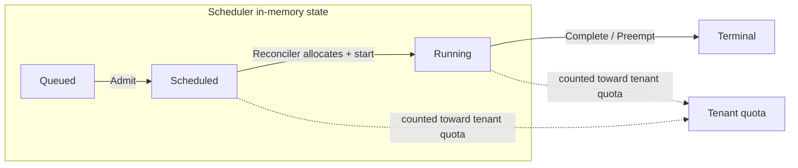
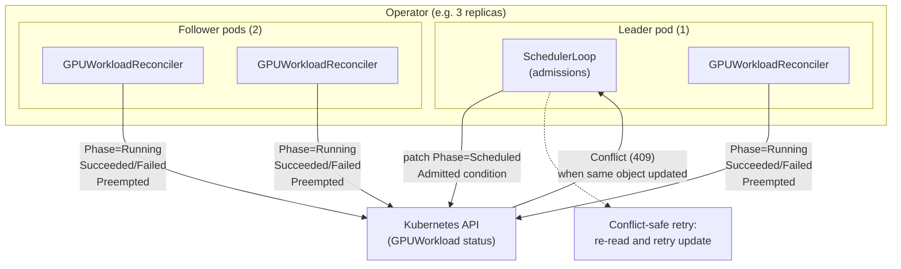
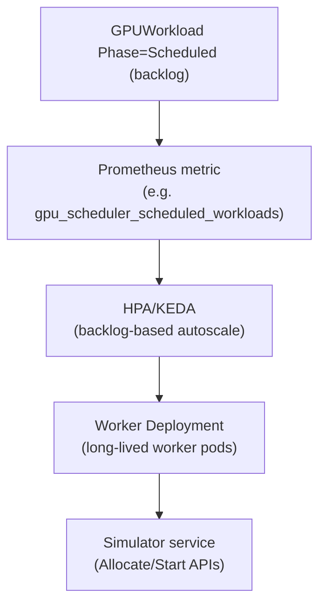
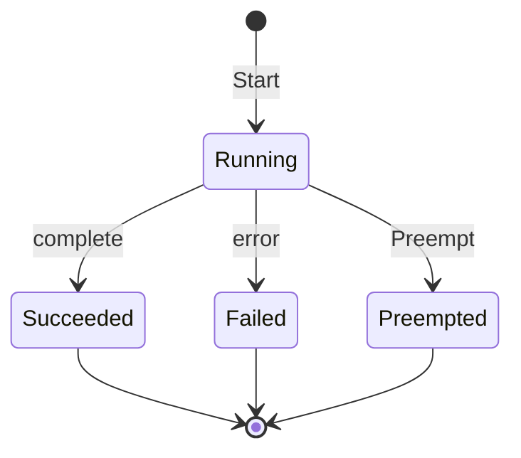
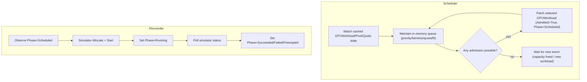
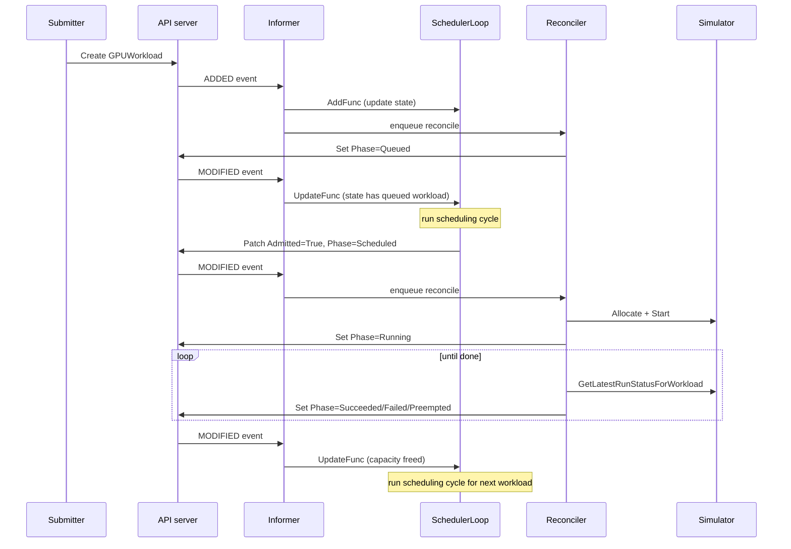
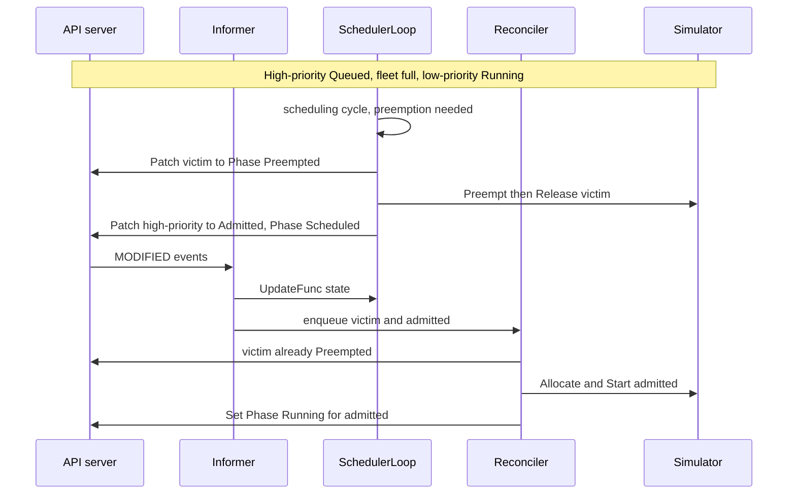

# README (seed)

# KGPU Scheduler Operator with Simulated Accelerators

A Kubernetes **operator (controller-runtime)** that schedules AI workloads onto a **simulated accelerator fleet** (GPU/TPU/Trainium profiles). Workloads are ingested through **Kafka** for burst handling, then reconciled as **CRDs** for policy-driven scheduling, lifecycle state, and observability.

## Problem

AI infra teams need to schedule heterogeneous workloads (training, batch inference, eval) onto scarce accelerators while enforcing:

- **Priority** (prod > batch > best-effort)
- **Fairness** (no tenant monopolies)
- **Tenant quotas** (hard caps)
- **Resource constraints** (GPU count/memory fit, runtime limits)

The hard part is the **control plane** (admission, bin-packing, preemption, policy, metrics)—not CUDA kernels. This project demonstrates those control-plane concerns locally without requiring real GPUs.

## Goals

### Functional

- Ingest workload requests via Kafka and create `GPUWorkload` CRs (idempotent).
- Maintain a declarative `GPUNodePool` CR that defines a **logical accelerator fleet**.
- Implement scheduling policies: priority, fair-share, quotas, resource fit.
- Support **preemption** of lower-priority workloads.
- Simulate execution time from “work units” (tokens) and hardware profiles.
- Track full lifecycle in CR status: `Queued → Scheduled → Running → Succeeded/Failed/Preempted`.
- Export Prometheus metrics for queue health, utilization, and latency.

### Non-goals

- Running real CUDA/Metal kernels or achieving real tokens/sec benchmarks.
- Replacing the Kubernetes scheduler end-to-end.

## Architecture

### Why this pipeline?

**Producer → Kafka → Submitter → Kubernetes Operator → Worker Pool → Simulator**

- **Kafka** absorbs bursts and provides durable ingestion and lag-based scaling.
- **CRDs** provide a Kubernetes-native source of truth and an auditable lifecycle.
- **Operator** enforces policy (priority/fairness/quotas/constraints) centrally.
- **Worker pool** represents the execution data plane.
- **Simulator** models accelerator contention and job duration using vendor-backed profiles.

### Component responsibilities

- **Producer**
  - Publishes `WorkloadRequest` messages to Kafka (`gpu.workloads.submit`).
- **Kafka**
  - Durable ingestion, partitions by key (tenant or queue), lag as scaling signal.
- **Submitter (Kafka consumer)**
  - Stateless ingestion worker.
  - Validates messages.
  - Creates `GPUWorkload` CRs idempotently (CR name derived from `request_id`).
  - Commits offsets only after CR creation success / AlreadyExists.
- **Kubernetes Operator (Scheduler control plane)**
  - Watches `GPUWorkload`, `GPUNodePool`, `TenantQuota`.
  - Maintains in-memory state in three buckets: **Queued** (waiting for admission), **Scheduled** (admitted, not yet running), and **Running** (executing). Tenant quotas are enforced against both Scheduled and Running (committed + in-use GPUs).
  - Picks next workloads using policy: priority + fairness + quotas + fit constraints.
  - Allocates simulated devices and updates CR status.
  - Optionally creates/controls execution pods.
- **Worker Pool (Execution wrappers)**
  - Executes admitted workloads by calling simulator APIs (or waits/polls).
  - Represents a realistic data-plane boundary and failure modes.
- **Simulator Service**
  - Source of truth for simulated device allocations.
  - Tracks device memory, occupancy, runtime estimation, and completion.
  - Run status: Running, Succeeded, Failed, Preempted (Preempted after Preempt).
  - Uses hardware profiles derived from vendor specs:
    - NVIDIA H100 memory and bandwidth published by NVIDIA :contentReference[oaicite:0]{index=0}
    - NVIDIA A100 memory bandwidth published by NVIDIA :contentReference[oaicite:1]{index=1}
    - Google TPU v5e capacity/bandwidth/compute published by Google :contentReference[oaicite:2]{index=2}
    - AWS Trainium (Trn1) HBM capacity/bandwidth published by AWS :contentReference[oaicite:3]{index=3}

## Diagrams

### End-to-end pipeline

### Architecture evolution (low scale → scale)

- **Phase 1 (Per-CR scheduling)**: each `GPUWorkload` reconcile lists all workloads and runs the scheduler inline; simple and fine at low queue depth.
- **Phase 2 (Central SchedulerLoop)**: a leader-elected loop maintains an in-memory queue from cached state, makes global admission decisions event‑driven, and lets reconcilers focus on actuation and status updates.

### Workload phases and scheduler state

The scheduler loop tracks workloads in three buckets that align with CR `Phase`:

| Phase      | Scheduler state | Meaning |
|-----------|------------------|---------|
| **Queued**   | `queued`         | Waiting for an admission decision. |
| **Scheduled**| `scheduled`      | Admitted; reconciler will allocate and start. Not yet consuming fleet. |
| **Running**  | `running`        | Allocated and executing in the simulator. |

**Tenant quotas** count both `scheduled` and `running` GPUs (committed + in-use), so a tenant cannot exceed its cap by having many admitted-but-not-yet-running workloads. Preemption victims are chosen only from `running` workloads.

### One leader scheduler, multiple reconcilers (contention)

The operator uses **one leader-elected scheduler loop** and **multiple reconciler replicas** (one per manager pod). Both write to the same `GPUWorkload` status (Phase, conditions, etc.), which can cause **optimistic concurrency conflicts** (HTTP 409) when two writers update the same object.

**Contention scenario**

- The **scheduler loop** (leader only) patches a workload to `Phase=Scheduled` and sets the Admitted condition.
- The **GPUWorkloadReconciler** runs on **every** manager replica; it updates status when it initializes Phase/QueuedAt, runs admission execution (Phase → Running), polls running status (Succeeded/Failed), or marks Preempted.
- If the scheduler’s `Status().Update` races with a reconciler’s update on the same workload (e.g. reconciler already moved it to Running), the API server returns **Conflict** (resourceVersion changed). The scheduler loop therefore uses **conflict-safe retry**: on Conflict it re-reads the object and retries the update (see checklist 25A.6).

**Why one leader for scheduler but multiple reconcilers?**

- **Scheduler loop (leader only)**  
Admission is a **global** decision over the in-memory queue and fleet state. Running that on a single leader avoids duplicate admissions, keeps a single view of the queue, and makes event-driven coalescing (one cycle per burst) simple. Leader election ensures only one pod runs the scheduler loop.
- **Reconcilers (all replicas)**  
Actuation (finalizers, execute admission when `Phase=Scheduled`, poll running, delete cleanup) is **per object**. Spreading reconciliation across replicas gives throughput and availability: more pods = more workloads reconciled in parallel. Controller-runtime already partitions work (e.g. by namespace or name) so replicas don’t normally fight over the same object, but the **scheduler loop and the reconciler** can still write the same workload (scheduler sets Scheduled, reconciler then sets Running), hence conflicts and retry.

The diagram below summarizes the layout.

- **SchedulerLoop** runs only on the leader; it writes to workload status when admitting or marking victims Preempted.
- **GPUWorkloadReconciler** runs on every replica; it writes when actuating (Scheduled→Running, running→terminal, preempted).
- Contention occurs when both touch the same `GPUWorkload`; the scheduler uses retry-on-conflict to re-read and re-apply.

### Worker pool scaling

- **Backlog as signal**: scale workers based on the number of `GPUWorkload` objects in `Phase=Scheduled` (admitted but not yet running).
- **Long-lived workers**: workers are a Deployment of pods that each claim and execute multiple workloads by calling the simulator, rather than one Job per workload.
- **Autoscaling**: use HPA or KEDA with a custom metric (e.g. “Scheduled workloads per pod”) so a burst of admissions automatically fans out across more worker pods.

### Worker concurrency and simulator

Multiple workers can execute different workloads at the same time. The simulator tracks **multiple allocations and multiple runs** concurrently (one entry per workload in `allocations`, one per run in `runs`). Each run has its own `StartedAt` and `EndsAt`; completion is **time-based**: when a worker calls `GetStatus(runID)`, the simulator checks wall-clock time against that run's `EndsAt` and may set `Status=Succeeded`. So workloads "run in parallel" in the sense that many runs coexist and each completes at its own simulated end time—the simulator does not serialize logical execution.

**Mutex and API serialization**

All simulator state (allocations, runs, nodes) is protected by a **single mutex** (`s.mu`). Every `Allocate`, `Start`, and `GetStatus` holds that lock for the duration of the call. So:

- **Only one API call runs at a time** in the critical section. If many workers call `Start()` or `GetStatus()` at once, they queue on the lock; each call is short (map lookup, time check, maybe a status update), so hold time is on the order of microseconds.
- The mutex does **not** mean "only one workload can be running." It only serializes **access** to the shared maps. Many runs can be `Running` at once; they all progress in time and complete when their `EndsAt` is reached and someone polls `GetStatus` for that run.

**Burst contention**

If a **large number of workers** start jobs at similar times with similar durations, they can all call `GetStatus()` (and earlier `Start()`) in sync when polling for completion. In that case they **serialize on the mutex**: only one call proceeds at a time, the rest block in `Lock()`. Tail latency can spike (e.g. N workers × a few microseconds per critical section = milliseconds for large N). So high concurrency of simulator API calls can cause **lock contention** during bursts, even though each critical section is small.

**Reducing contention: sharding simulator state**

To spread load across multiple locks, the simulator's state can be **sharded** (e.g. by workload ID or run ID). Each shard has its own `allocations`, `runs`, and mutex; a request is routed to one shard (e.g. `hash(workloadID) % numShards`). Then concurrent `GetStatus` (and `Start`/`Allocate`) calls from many workers hit different shards and different locks, reducing contention. Tradeoffs: cross-shard operations (e.g. "list all runs" or fleet-wide capacity) require aggregating over shards; allocation and preemption logic may need to be aware of shard boundaries.

**Capacity enforcement and overscaled workers**

When there are more workers (or admitted Scheduled workloads) than simulator capacity, the simulator **never over-allocates**: `Allocate` only adds an allocation after it finds enough free devices; if placement fails (e.g. fleet full), it returns an error and does not record an allocation. The deployment worker then marks the workload **Failed** and backs off for a short period (configurable, default 10s) before claiming another, so overscaled workers get **fast failure** (no retry storm on the same workload) and **backoff** (reduced thundering herd on the next claim). See `internal/sim` test `TestAllocate_CapacityEnforcement_NoOverAllocation` and worker `AllocateStartFailureBackoff`.

### Simulator run status (internal/sim/contract.go)

### Operator decision flow (GPUWorkload reconciliation)

Scale note: for low latency at high queue depth, the scheduler loop should be event-driven (watch-based) and operate on cached state, not by re-listing all workloads in every reconcile or requeueing each queued workload on a timer.

### End-to-end flow (scale-friendly architecture)

When the SchedulerLoop owns admissions and the reconciler is actuation-only, the flow looks like this:

1. **Submitter** creates a `GPUWorkload` CR via the Kubernetes API.
2. **API server** persists to etcd and sends an **ADDED** event on the watch stream.
3. **Informer** receives the event, updates the cache, and calls registered handlers:
  - **SchedulerLoop** `AddFunc` runs → updates in-memory state (queued workloads, running, fleet, quotas).
  - **Reconciler** watch enqueues a reconcile request for this workload.
4. **Reconciler** (first pass): adds finalizer if missing; if `Phase` is empty, sets `Phase=Queued` and `QueuedAt`, then updates status. Returns.
5. **Status update** → **MODIFIED** event → informer handlers run again. SchedulerLoop state now includes the new queued workload.
6. **SchedulerLoop** reacts to the event (new Queued workload) and runs a **scheduling cycle**.
7. **SchedulerLoop** picks the best candidate from its in-memory queue (priority, fairness, fit, preemption), then **patches** that `GPUWorkload` to `Admitted=True` and `Phase=Scheduled`.
8. **Patch** → **MODIFIED** event → reconciler is enqueued for the patched workload.
9. **Reconciler** (actuation pass): sees `Phase=Scheduled`, calls simulator `Allocate` and `StartWithRuntimeInput`, then sets `Phase=Running`. Returns.
10. **Phase=Running** → reconciler keeps getting triggered (or polls). It calls `GetLatestRunStatusForWorkload` until the run is Succeeded/Failed/Preempted, then updates the CR phase accordingly.
11. **Workload completion** → **MODIFIED** event (Phase changed) → SchedulerLoop state is updated (workload leaves running set). This triggers another scheduling cycle so the next queued workload can be admitted.

Key difference from Phase 1: the **SchedulerLoop** makes admission decisions and patches; the **reconciler** only does finalizers, actuation (Allocate/Start), and status polling. No per-workload scheduler logic in the reconciler.

### Preemption flow (scale-friendly architecture)

When capacity is full and a high-priority workload is queued, the scheduler preempts a lower-priority running workload:

### Preemption storm (edge case)

With a **large volume of high-priority requests**, the scheduler can repeatedly preempt running workloads: each new high-priority admission evicts a running one, which may be re-queued and later re-admitted, leading to churn and starvation of lower-priority work. Mitigations include: **backpressure** (e.g. max admissions per cycle, rate limits), **priority bands** so preemption only happens across bands, or a **preemption budget** (max preemptions per workload or per time window). The checklist’s backpressure controls (max admissions per tick, rate limiting) help limit this.

## Scaling

The end-to-end pipeline has **different bottlenecks** at each stage. For **resource estimation** on a constrained node (e.g. 8G Docker) and scale-demo results, see [Scale and resource results](docs/demo-results-scale.md). Components must be **scaled separately** on the right signals so one stage does not become the limiter for the whole system.

| Stage                       | Bottleneck             | What to scale                              | Scale on / parameters                                                                                                                                                                                                                                   |
| --------------------------- | ---------------------- | ------------------------------------------ | ------------------------------------------------------------------------------------------------------------------------------------------------------------------------------------------------------------------------------------------------------- |
| **Kafka → Submitter**       | Ingestion throughput   | Submitter consumer group size              | **Consumer lag** (e.g. KEDA on `kafka_consumer_lag`). More partitions + more consumers = higher ingest rate.                                                                                                                                            |
| **Submitter → API**         | CR create rate         | Submitter replicas (stateless)             | Same lag-based scaling; each replica creates CRs from its partition(s).                                                                                                                                                                                 |
| **Operator: SchedulerLoop** | Admission decisions    | **Single leader** (no horizontal scale)    | Throughput is one cycle per event burst (coalesced). Scale by keeping cycles cheap (cached state, no list-heavy work). Backpressure (max admissions per cycle, batching) lets one leader admit more per cycle.                                          |
| **Operator: Reconciler**    | Actuation throughput   | **Operator replicas** (manager Deployment) | **Reconciliation backlog** or API server load. More replicas = more `GPUWorkload` objects reconciled in parallel (finalizers, Scheduled→Running, status polling).                                                                                       |
| **Worker pool**             | Execution capacity     | **Worker Deployment** replicas             | **Backlog**: count of `GPUWorkload` in `Phase=Scheduled` (admitted but not yet running). HPA/KEDA on e.g. `scheduled_workloads_per_pod` or total Scheduled count. Scale workers so admitted work is started and run in the simulator without piling up. |
| **Simulator**               | Run capacity / latency | Simulator service replicas (if separate)   | Request rate, queue depth, or P99 latency. Only relevant if the simulator is a separate scalable service.                                                                                                                                               |

**Why scale separately?**

- **Submitter** scales on **ingestion**: if producers send bursts, you need enough consumers to drain the topic and create CRs; otherwise lag grows and scheduling sees new work too late.
- **Operator replicas** scale **reconciliation** (control plane): more CRs, more status updates. They do **not** scale the number of admission decision-makers (scheduler stays one leader).
- **Worker pool** scales **execution** (data plane): a separate worker Deployment calls Allocate/Start and runs workloads in the simulator. Scale that Deployment on **backlog** so admitted workloads are picked up and run without delay. Operator pods stay lightweight and execution capacity is independent of reconciliation capacity.

So: **ingestion** (submitter), **scheduling** (one leader, optimize per-cycle), **reconciliation** (operator replicas), and **execution** (worker pool replicas) are four different knobs. Scaling only one (e.g. operator replicas) can leave another (e.g. consumer lag or worker backlog) as the bottleneck.

## Tradeoffs

### Kafka intake + CRD scheduling queue

- Kafka is ideal for ingestion scalability and lag-driven autoscaling.
- CRDs are ideal for policy correctness and lifecycle tracking (status, conditions, events).
- Submitter is intentionally “dumb”; operator is intentionally “smart”.

### Why simulate accelerators?

- Most scheduling correctness depends on:
  - capacity constraints (count/memory)
  - contention
  - runtime distribution
  - preemption behavior
  - queue dynamics
- Those can be modeled locally using vendor-backed profiles. Absolute throughput is not the goal.

## Development commands

For contributor docs, see:

- `docs/contributor-workflow.md`

