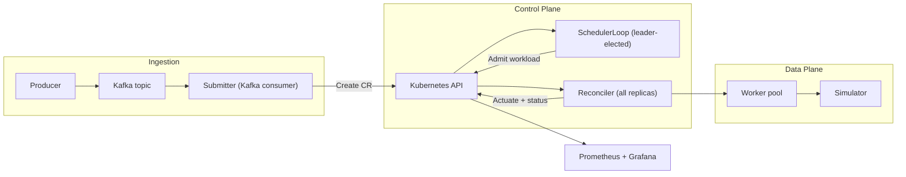
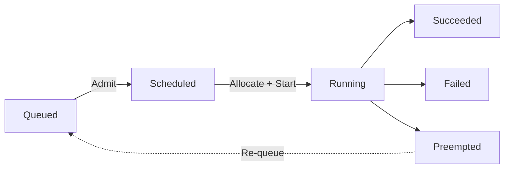

# KGPU Scheduler

**A Kubernetes operator that schedules AI/ML workloads onto a simulated heterogeneous accelerator fleet (GPU, TPU, Trainium) with priority, fairness, tenant quotas, and preemption.**

Built with [controller-runtime](https://github.com/kubernetes-sigs/controller-runtime) and designed around the same control-plane concerns that real AI infrastructure teams face — admission control, bin-packing, multi-tenant fairness, and observability — without requiring physical hardware.

---

## Why This Exists

Scheduling heterogeneous AI workloads (training, inference, eval, fine-tuning, RLHF) onto scarce accelerators is a **control-plane problem**: the hard part is admission policy, resource fitting, preemption logic, queue dynamics, and multi-tenant fairness — not CUDA kernels. This project demonstrates those concerns end-to-end on a local Kind cluster using vendor-backed hardware profiles (NVIDIA H100/A100, Google TPU v5e, AWS Trainium).

## Key Capabilities

- **Priority-based scheduling** — higher-priority workloads are admitted first; configurable priority levels per workload
- **Preemption** — when the fleet is full, high-priority work evicts lower-priority running workloads, which are re-queued and rescheduled when capacity frees
- **Tenant quotas (hard caps)** — `TenantQuota` CRDs enforce per-tenant GPU limits across both scheduled and running workloads
- **Weighted round-robin fairness** — admission interleaves across tenants to prevent monopolization
- **Kafka-based ingestion** — burst-tolerant, durable intake with lag-driven autoscaling (KEDA) for submitter replicas
- **CRD-native lifecycle** — full workload lifecycle tracked as Kubernetes status: `Queued → Scheduled → Running → Succeeded / Failed / Preempted`
- **Simulated accelerator fleet** — hardware profiles derived from vendor specs model capacity, memory, bandwidth, and runtime duration per workload kind
- **Six workload kinds** — training, inference, eval, fine-tuning, embedding, RLHF — each with kind-specific duration modeling
- **Prometheus metrics and Grafana dashboards** — queue depth, admission rate, completion rate, E2E latency, device utilization, per-component CPU/memory
- **Horizontally scalable pipeline** — submitters, workers, and operator replicas scale independently on different signals; scaling strategy validated with 10k-workload experiments

## Architecture

```
Producer → Kafka → Submitter → Kubernetes API → Operator (Scheduler + Reconciler) → Workers → Simulator
```



| Component | Role |
|-----------|------|
| **Producer** | Publishes `WorkloadRequest` messages to Kafka with configurable concurrency and partitioning |
| **Kafka** | Durable ingestion buffer; partitions enable parallel consumption; lag drives KEDA autoscaling |
| **Submitter** | Stateless Kafka consumer that idempotently creates `GPUWorkload` CRs from messages |
| **Operator** | Leader-elected scheduler loop makes global admission decisions (priority, fairness, quotas, fit); reconcilers on all replicas handle actuation (allocate, start, poll, release) |
| **Workers** | Long-lived pods that claim admitted workloads and execute them against the simulator (watch-based, polling, or queue-based discovery) |
| **Simulator** | In-memory accelerator fleet with vendor-backed profiles; tracks allocations, runs, and completion by wall-clock time |

> For deep dives into the concurrency model, state machines, worker discovery modes, preemption flow, and scaling strategy, see **[Architecture](docs/architecture.md)**.

## Workload Lifecycle



Tenant quotas count both **Scheduled** and **Running** GPUs, preventing a tenant from over-committing by flooding the admission queue.

## Validated Scenarios

All scenarios run end-to-end on a local Kind cluster (producer → Kafka → submitter → operator → workers → simulator). Full results with event logs and proof in **[Functional Validation](docs/demo-results.md)**.

| Scenario | What It Proves |
|----------|---------------|
| **Contention queueing** | Excess workloads queue correctly and drain as capacity frees |
| **Priority scheduling** | Higher-priority workloads are admitted strictly before lower-priority ones |
| **Tenant quotas** | Workloads beyond a tenant's hard cap stay queued until capacity frees |
| **Fairness (WRR)** | Admission interleaves across tenants rather than draining one first |
| **Preemption** | High-priority work evicts low-priority running work and runs immediately |
| **Mixed workload kinds** | Kind-specific duration modeling produces correct relative completion order |

## Scale Analysis

Validated with **10,000 workloads** on an 8 GB Kind node under a 22-pod budget. Systematically swept the submitter/worker split to identify bottleneck transitions (ingestion → admission → execution) and achieved **~250x improvement in E2E p99 latency** through configuration tuning alone.

| Configuration | E2E p99 | Completion Rate | Queue Peak |
|---------------|---------|-----------------|------------|
| Baseline (1 admit/cycle, 12 sub, 8 workers) | ~2.25 h | ~3.75 wl/s | 6,965 |
| Optimized (5/cycle, 6 sub, 16 workers) | **~32 s** | ~6.3 wl/s | 61 |

Full methodology, per-stage analysis, and Grafana screenshots in **[Scale Analysis](docs/demo-results-scale.md)**.

## Quick Start

**Prerequisites:** Docker, [Kind](https://kind.sigs.k8s.io/), [Helm](https://helm.sh/), `kubectl`, Go 1.22+

```bash
# Deploy the full pipeline (Kind cluster, Kafka, KEDA, simulator, operator, submitter, workers, monitoring)
make stack-up

# Port-forward Grafana and Kafka
kubectl port-forward -n monitoring svc/kube-prometheus-stack-grafana 3001:80 &
kubectl port-forward -n kafka pod/kafka-dual-role-0 9092:9094 &

# Submit 10 workloads with contention
make run-producer ARGS="-brokers=localhost:9092 -config=config/demo/contention-10-workloads.json -burst"

# Watch workloads progress through their lifecycle
kubectl get gpuworkloads -w

# Tear down
make stack-down-fast
```

Grafana dashboards are in `config/grafana/dashboards/`. Import `gpu-scheduler-pipeline.json` and `gpu-scheduler-resources.json` after adding the Prometheus datasource.

## Project Structure

```
cmd/
  main.go                          Manager entrypoint (controller-runtime)
  producer/main.go                 Kafka workload producer
api/v1alpha1/                      CRD schemas (GPUWorkload, GPUNodePool, TenantQuota)
internal/
  controller/                      Reconciliation logic + scheduler loop
  sim/                             Simulated accelerator fleet + hardware profiles
  kafka/                           Kafka producer/consumer + message types
  worker/                          Worker deployment loop + discovery modes
config/
  crd/bases/                       Generated CRD manifests
  demo/                            Workload fixtures for demos
  grafana/dashboards/              Pipeline and resource Grafana dashboards
deploy/                            Kubernetes manifests (Kafka, KEDA, simulator, submitter, workers, monitoring)
scripts/                           Demo capture, CSV export, preemption runner
```

## Documentation

| Document | Description |
|----------|-------------|
| **[Architecture](docs/architecture.md)** | Component design, state machines, concurrency model, worker discovery, scaling strategy |
| **[Functional Validation](docs/demo-results.md)** | Scenario-by-scenario behavioral validation with event logs |
| **[Scale Analysis](docs/demo-results-scale.md)** | 10k-workload scale experiments, bottleneck analysis, resource estimation |
| **[Contributor Guide](docs/contributor-workflow.md)** | Development setup, Make targets, scaffolding, project layout |

## Tech Stack

- **Go** + **controller-runtime** (Kubebuilder-scaffolded operator)
- **Kafka** (Strimzi) for durable ingestion
- **KEDA** for lag-driven and metric-driven autoscaling
- **Prometheus** + **Grafana** for observability
- **Kind** for local Kubernetes
- **Ginkgo** + **Gomega** for BDD-style testing; **gomock** for interface mocks
- **envtest** for integration tests with real API server + etcd
