# Architecture

This document covers the internal design of the KGPU Scheduler: component responsibilities, state management, concurrency model, worker discovery modes, and scaling strategy.

---

## Table of Contents

- [Pipeline Overview](#pipeline-overview)
- [Component Responsibilities](#component-responsibilities)
- [Workload Lifecycle and Scheduler State](#workload-lifecycle-and-scheduler-state)
- [Architecture Evolution](#architecture-evolution)
- [Concurrency Model](#concurrency-model)
- [Operator Decision Flow](#operator-decision-flow)
- [End-to-End Flow (Sequence)](#end-to-end-flow-sequence)
- [Preemption](#preemption)
- [Worker Pool](#worker-pool)
- [Simulator](#simulator)
- [Scaling Strategy](#scaling-strategy)
- [Tradeoffs](#tradeoffs)

---

## Pipeline Overview

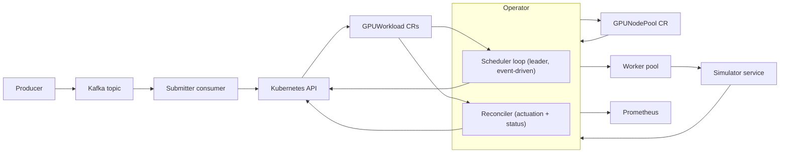

**Why this pipeline?**

- **Kafka** absorbs ingestion bursts and provides durable intake with lag-based autoscaling.
- **CRDs** give a Kubernetes-native source of truth with auditable lifecycle and status conditions.
- **Operator** enforces scheduling policy (priority, fairness, quotas, constraints) centrally as a leader-elected loop.
- **Worker pool** represents the execution data plane, decoupled from the control plane.
- **Simulator** models accelerator contention and job duration using vendor-backed profiles (NVIDIA H100/A100, Google TPU v5e, AWS Trainium).

---

## Component Responsibilities

| Component | Responsibility |
|-----------|---------------|
| **Producer** | Publishes `WorkloadRequest` messages to Kafka (`gpu.workloads.submit`). Supports serial, burst, and concurrent round-robin modes. |
| **Kafka** | Durable ingestion buffer. Partitions by key (tenant or request ID); consumer group lag drives KEDA scaling of submitter replicas. |
| **Submitter** | Stateless Kafka consumer. Validates messages, creates `GPUWorkload` CRs idempotently (name derived from `request_id`), commits offsets only on success or `AlreadyExists`. |
| **Operator (Scheduler)** | Leader-elected loop watches cached `GPUWorkload`, `GPUNodePool`, and `TenantQuota` state. Maintains an in-memory queue with three buckets (Queued, Scheduled, Running). Makes global admission decisions using priority + fairness + quotas + fit. Patches selected workloads to `Phase=Scheduled`. |
| **Operator (Reconciler)** | Runs on all replicas. Handles actuation: adds finalizers, executes admission (allocate + start in simulator), polls run status, updates CR phase to terminal states. |
| **Workers** | Long-lived pods that claim `Phase=Scheduled` workloads and run them against the simulator. Discovery via shared informer (watch), polling, or Kafka queue. |
| **Simulator** | In-memory accelerator fleet. Tracks device allocations, run status, and completion by wall-clock time. Hardware profiles define memory, bandwidth, and compute per accelerator type. |

---

## Workload Lifecycle and Scheduler State

The scheduler loop tracks workloads in three buckets that map directly to CR `Phase`:

| Phase | Scheduler State | Meaning |
|-------|-----------------|---------|
| **Queued** | `queued` | Waiting for an admission decision |
| **Scheduled** | `scheduled` | Admitted; reconciler will allocate and start |
| **Running** | `running` | Allocated and executing in the simulator |

**Tenant quotas** count both Scheduled and Running GPUs (committed + in-use), so a tenant cannot exceed its cap by accumulating admitted-but-not-yet-running workloads.

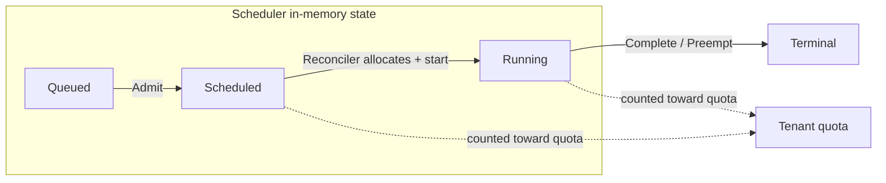

---

## Architecture Evolution

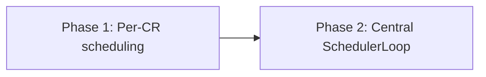

- **Phase 1 (Per-CR scheduling):** Each `GPUWorkload` reconcile lists all workloads and runs the scheduler inline. Simple, fine at low queue depth.
- **Phase 2 (Central SchedulerLoop):** A leader-elected loop maintains an in-memory queue from cached state, makes global admission decisions event-driven, and lets reconcilers focus purely on actuation. This is the current architecture.

---

## Concurrency Model

### One Leader Scheduler, Multiple Reconcilers

The operator runs **one leader-elected scheduler loop** and **multiple reconciler replicas** (one per manager pod). Both write to the same `GPUWorkload` status, which can cause **optimistic concurrency conflicts** (HTTP 409).

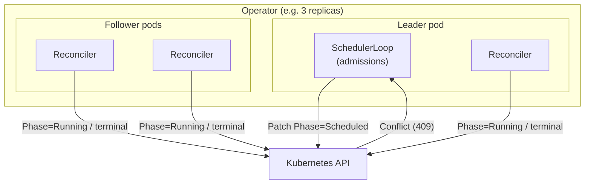

**Why this split?**

- **Scheduler (leader only):** Admission is a global decision over the queue and fleet. Running on a single leader avoids duplicate admissions and keeps a single view of state.
- **Reconcilers (all replicas):** Actuation is per-object. Spreading across replicas gives throughput and availability.
- **Conflict handling:** When the scheduler's status update races with a reconciler's update, the API server returns 409. The scheduler uses conflict-safe retry: re-read and re-apply.

---

## Operator Decision Flow

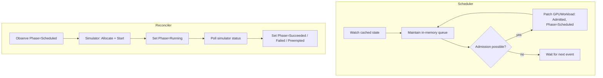

---

## End-to-End Flow (Sequence)

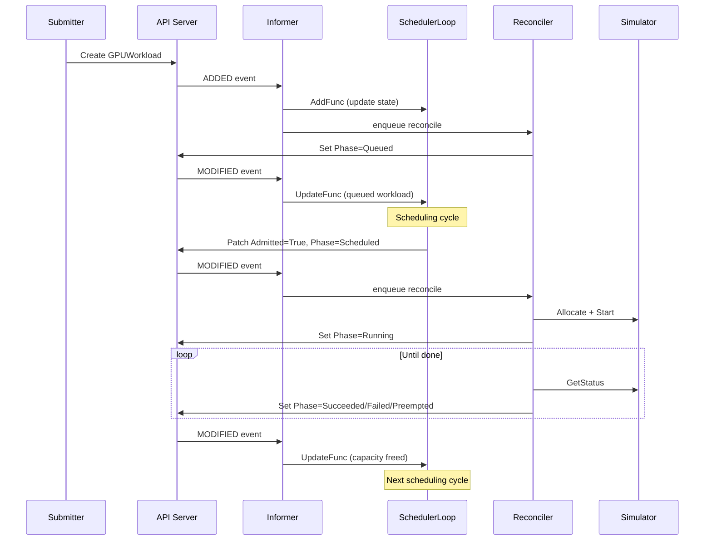

1. **Submitter** creates a `GPUWorkload` CR.
2. **Informer** receives the ADDED event, updates cache, notifies the scheduler and reconciler.
3. **Reconciler** initializes the CR (finalizer, `Phase=Queued`, `QueuedAt`).
4. **SchedulerLoop** reacts to the new queued workload, runs a scheduling cycle, picks the best candidate (priority, fairness, fit, preemption), and patches it to `Phase=Scheduled`.
5. **Reconciler** sees `Phase=Scheduled`, calls simulator `Allocate` + `Start`, sets `Phase=Running`.
6. **Reconciler** polls `GetStatus` until the run completes, then updates to terminal phase.
7. **Completion** frees capacity, triggering the next scheduling cycle.

---

## Preemption

When the fleet is full and a high-priority workload is queued, the scheduler preempts a lower-priority running workload:

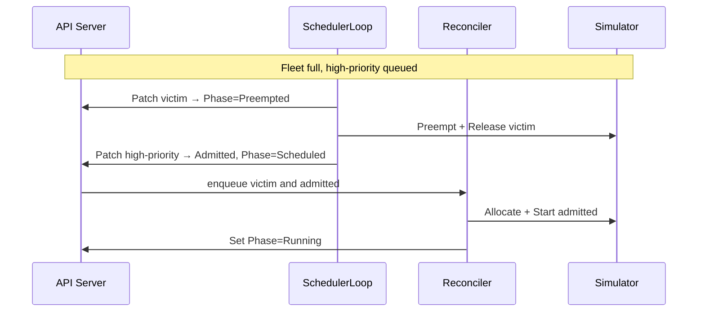

**Preemption victim selection:** Same priority → most recently started. Victims are chosen only from Running workloads.

**Preemption storm mitigation:** Large volumes of high-priority requests can cause churn. Mitigations include max admissions per cycle (backpressure), priority bands, and preemption budgets.

---

## Worker Pool

### Scaling

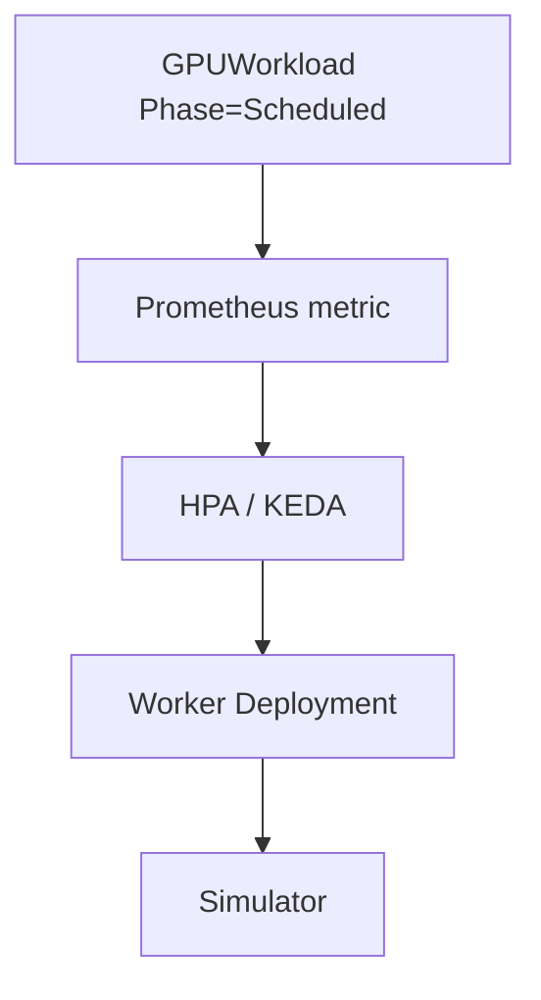

Workers scale on **scheduled backlog** — the count of `GPUWorkload` objects in `Phase=Scheduled` (admitted but not yet running). Workers are long-lived pods that each claim and execute multiple workloads.

### Discovery Modes

**Watch (default):** Each worker runs a shared informer for `GPUWorkload`. The informer does an initial list and maintains a watch; workers discover work from the in-memory cache. Event-driven wake-up on Add/Update for `Phase=Scheduled` workloads. When idle, workers block on the watch stream with minimal CPU.

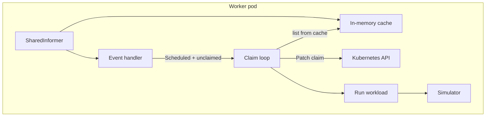

**Cache memory consideration:** Each worker has its own informer cache. With N workers and M workloads, total memory scales as N x M. At scale (5k+ workloads), this can cause OOM. Mitigations:

| Approach | Description |
|----------|-------------|
| **Label selector** | Informer watches only `claimable=true` workloads; cache stays small |
| **Custom store** | Cache retains only Phase=Scheduled, unclaimed objects |
| **Polling** (`USE_WATCH=false`) | Workers list with a label selector; no long-lived cache |
| **Queue-based** (`USE_QUEUE=true`) | Workers consume from Kafka `gpu.workloads.claimable` topic; no informer at all |

**Queue-based discovery (`USE_QUEUE=true`):** When the scheduler admits a workload, it publishes a `ClaimableWorkloadMessage` to the `gpu.workloads.claimable` Kafka topic. Workers join a consumer group, read messages, `Get` the workload by name, claim it, and run it. No informer, so memory per worker is constant regardless of total workload count.

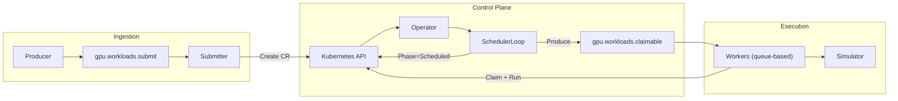

### Concurrency and Capacity

Multiple workers execute different workloads simultaneously. The simulator tracks multiple allocations and runs concurrently — each run has its own `StartedAt`/`EndsAt` and completes independently by wall-clock time.

**Capacity enforcement:** The simulator never over-allocates. If placement fails (fleet full), `Allocate` returns an error. The worker marks the workload `Failed` and backs off before claiming another, preventing retry storms.

---

## Simulator

The simulator (`internal/sim/contract.go`) is the source of truth for device allocations and run status.

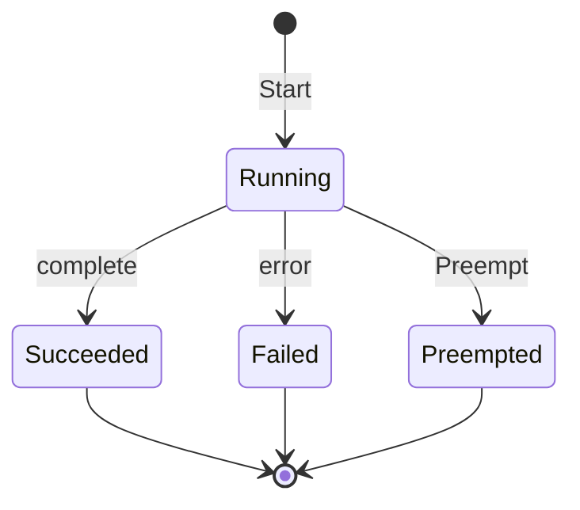

**Hardware profiles** are derived from vendor specifications:
- NVIDIA H100 SXM (80 GB HBM3, 3.35 TB/s bandwidth)
- NVIDIA A100 (80 GB HBM2e, 2.0 TB/s bandwidth)
- Google TPU v5e
- AWS Trainium (Trn1)

Profiles define memory capacity, bandwidth, and compute characteristics. The simulator uses these to estimate run duration based on workload kind, token count, and kind-specific parameters (batch size, sequence length, gradient accumulation, etc.).

**Thread safety:** All simulator state is protected by a single mutex. Each API call (`Allocate`, `Start`, `GetStatus`) holds the lock briefly (map lookups, time checks). Many runs coexist and progress in time; the mutex serializes access, not execution. For high concurrency, state can be sharded by workload ID.

---

## Scaling Strategy

The pipeline has different bottlenecks at each stage. Components must be scaled independently on the right signals.

| Stage | Bottleneck | What to Scale | Scale Signal |
|-------|-----------|---------------|-------------|
| **Ingestion** (Submitter) | Throughput into K8s | Submitter replicas + Kafka partitions | Consumer lag (KEDA) |
| **Admission** (SchedulerLoop) | Decision rate | Single leader — tune `MAX_ADMISSIONS_PER_CYCLE` | Queue depth, queue wait p99 |
| **Execution** (Workers) | Run capacity | Worker Deployment replicas | Scheduled backlog count |
| **Actuation** (Reconciler) | Status processing | Operator Deployment replicas | Completion rate vs. run completion rate |

**Scale left to right:** Start each stage at or near max capacity, watch the downstream metric. If it suffers, the current stage is the bottleneck.

- **Submitter** scales on ingestion (consumer lag). More replicas + partitions = higher ingest rate.
- **Scheduler** is a single leader. Throughput is tuned via `MAX_ADMISSIONS_PER_CYCLE`, not replicas.
- **Operator replicas** scale actuation (reconcile throughput), not admission.
- **Workers** scale execution (data plane). Scale on scheduled backlog.

**Execution and actuation are parallel bottlenecks** downstream of admission. To determine which limits throughput, compare Worker "Runs completed" rate vs. Operator "Workload completions" rate in the pipeline dashboard.

### Producer Concurrency

The producer supports concurrent round-robin partitioning for generating sharp ingestion spikes:

- `-concurrency=1` (default): serial sends with hash-based partitioning
- `-concurrency=N`: N goroutines, each dedicated to one partition, with round-robin message distribution across all targeted partitions

```bash
# 2000 workloads, bursty, spread across 14 partitions
make run-producer ARGS="-brokers=localhost:9092 \
  -config=config/demo/scale-2000-workloads.json \
  -burst -concurrency=14 -partitions=14"
```

---

## Tradeoffs

**Kafka + CRD hybrid:** Kafka handles ingestion scalability and lag-driven autoscaling. CRDs handle policy correctness and lifecycle tracking (status, conditions, events). The submitter is intentionally stateless; the operator is intentionally smart.

**Simulated accelerators:** Scheduling correctness depends on capacity constraints, contention, runtime distribution, preemption behavior, and queue dynamics — all of which can be modeled locally using vendor-backed profiles. Absolute hardware throughput is a non-goal.
