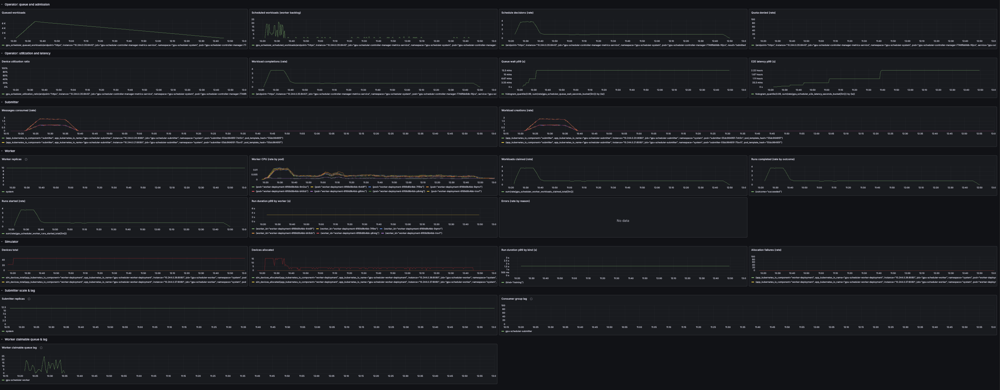
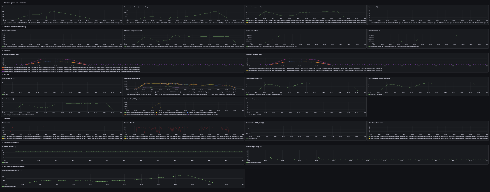
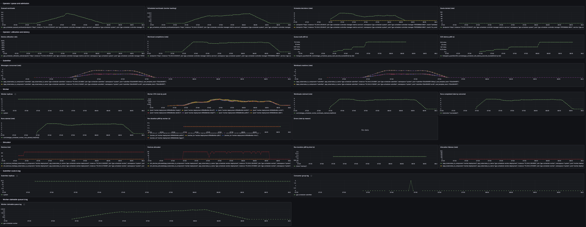
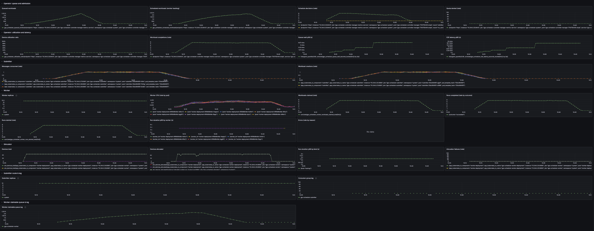
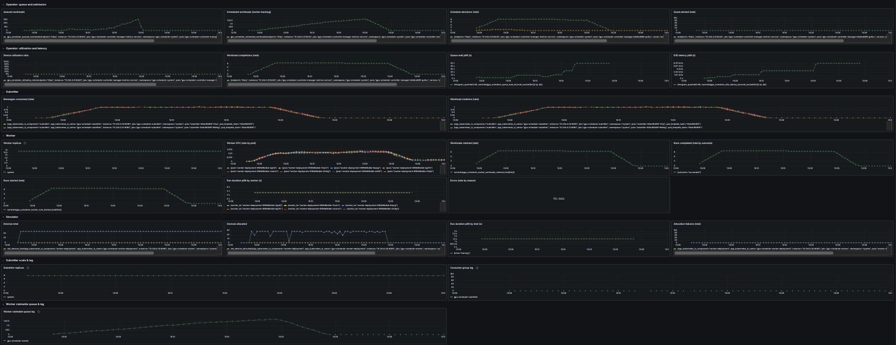
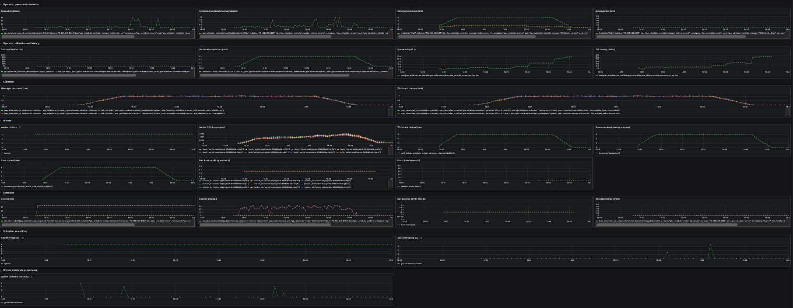

# Scale Analysis

Performance and scaling analysis of the KGPU Scheduler pipeline. Validated with **10,000 workloads** on an 8 GB Kind node under a 22-pod budget, systematically sweeping the submitter/worker configuration space to identify bottleneck transitions and optimize throughput.

For functional (behavioral) validation, see [Functional Validation](demo-results.md). For architecture and scaling strategy, see [Architecture](architecture.md).

---

## Key Findings

- **≈250x improvement in E2E p99 latency** (from ≈2.25 hours to ≈32 seconds) through configuration tuning alone — no code changes
- **Three distinct bottleneck regimes** identified: ingestion → admission → execution
- **Optimal configuration depends on the goal:** minimize fleet runtime (batch done ASAP) vs. minimize per-workload latency (E2E p99)
- Worker OOM at scale led to architectural evolution from per-job pods to **queue-based claimable workers**

### Results Summary

| Config | E2E p99 | Fleet Runtime | Completion Rate | Queue Peak | Schedule Peak |
|--------|---------|---------------|-----------------|------------|---------------|
| 1/cycle, 12 sub, 8 workers | ≈2.25 h | ≈147 min | ≈3.75 wl/s | 6,965 | 22 |
| 5/cycle, 12 sub, 8 workers | ≈67 min | ≈59 min | ≈4.3 wl/s | 6,495 | 1,776 |
| 5/cycle, 12 sub, 10 workers | ≈34 min | ≈42 min | ≈4.78 wl/s | 4,564 | 2,376 |
| 5/cycle, 10 sub, 12 workers | ≈17 min | ≈34 min | ≈5.72 wl/s | 2,522 | 2,286 |
| 5/cycle, 8 sub, 14 workers | ≈8.5 min | ≈30 min | ≈6.66 wl/s | 304 | 1,716 |
| **5/cycle, 6 sub, 16 workers** | **≈32 s** | ≈32 min | ≈6.3 wl/s | **61** | **10** |

*Each step roughly halved E2E p99 latency.* Config: admissions per scheduler cycle / submitter replicas / worker replicas. Fleet runtime = wall-clock from first submit to last Succeeded.

---

## Table of Contents

- [Resource Estimation](#resource-estimation)
- [Scaling Methodology](#scaling-methodology)
- [Baseline (10 workloads)](#baseline-10-workloads)
- [Scale Experiments (10k workloads)](#scale-experiments-10k-workloads)
- [Bottleneck Progression](#bottleneck-progression)
- [Conclusions](#conclusions)
- [Grafana Dashboards](#grafana-dashboards)

---

## Resource Estimation

On a memory-constrained node (8 GB Docker), all pipeline components must be capped to fit and avoid OOM.

| Component | Suggested Cap | Notes |
|-----------|--------------|-------|
| Kind control plane | ≈1 Gi | etcd + API server + core pods |
| Strimzi / Kafka | ≈1.5 Gi total | Single broker + Kafka Exporter |
| Operator (manager) | 512 Mi / pod | Leader runs scheduler + reconcilers; followers run reconcilers only |
| Submitter | 128 Mi / pod | Stateless Kafka consumers |
| Simulator | 128 Mi | In-memory state; low unless many concurrent runs |
| Worker | 128 Mi / pod | Scales on scheduled backlog |
| KEDA | ≈512 Mi total | Operator + metrics server |
| System buffer | ≈1 Gi | OS, Docker, eviction headroom |

**Minimal total (1 replica each):** ≈5.25 Gi. Leaves ≈2.75 Gi for scaling. Maximum replicas under 8 Gi (one component at a time): 22 submitters, 22 workers, or 6 operator pods. The 22-pod budget is shared — running all at max simultaneously exceeds 8 Gi.

<details>
<summary>Where caps are configured</summary>

| Component | Manifest |
|-----------|----------|
| Operator | `config/manager/manager.yaml` |
| Submitter | `deploy/submitter/deployment.yaml` |
| Simulator | `deploy/simulator/deployment.yaml` |
| Worker | `deploy/worker-deployment/deployment.yaml` |
| KEDA | `deploy/keda/values.yaml` |
| Kafka | `deploy/kafka/cluster.yaml` |

</details>

---

## Scaling Methodology

Scale **left to right** along the pipeline. Start each stage near max, watch the downstream metric. If it suffers, the current stage is the bottleneck.

| Stage | Scale Signal | Downstream Metric to Watch |
|-------|-------------|---------------------------|
| **Ingestion** (submitters + partitions) | Kafka consumer lag | Queue depth (`gpu_scheduler_queued_workloads`), queue wait p99 |
| **Admission** (scheduler loop) | `MAX_ADMISSIONS_PER_CYCLE` | Scheduled backlog (`gpu_scheduler_scheduled_workloads`) |
| **Execution** (workers) | Scheduled backlog | Worker "Runs completed" rate |
| **Actuation** (reconciler) | Completion rate gap | Operator "Workload completions" rate vs. Worker "Runs completed" rate |

To identify whether execution or actuation is the limiter downstream of admission, compare the worker completion rate to the operator completion rate in the Grafana pipeline dashboard.

---

## Baseline (10 workloads)

```bash
make stack-up
make run-producer ARGS="-brokers=localhost:9092 -config=config/demo/contention-10-workloads.json -burst"
```

**Results:** All 10 reached `Succeeded`. E2E p99 ≈31.7 s; queue wait p99 ≈3.11 s; sim run p99 ≈1.59 s. Allocation failures: 0. Operator memory ≈19 MiB; worker memory ≈33 MiB (well under caps).

---

## Scale Experiments (10k workloads)

### Setup

- **Fleet:** `config/demo/scale-demo-fleet.yaml` — 6 nodes × 4 devices = 24 GPUs (`h100_sxm`)
- **Workloads:** 10,000 generated in-memory from `config/demo/scale-seed-light.json` (2k tokens, 2 GPU each)
- **Producer:** `-seed-config=config/demo/scale-seed-light.json -seed-count=10000 -burst -concurrency=12 -partitions=12`
- **Workers:** Queue-based claimable mode (Kafka `gpu.workloads.claimable` topic)

### Experiment 1: Ingestion Bottleneck (1 admission/cycle)

**Config:** 12 submitters, 8 workers, `MaxAdmissionsPerCycle=1`

The scheduler admitted one workload per event cycle (≈3.75 wl/s). Queue built to **6,965** and took ≈131 minutes to drain. E2E p99 peaked at **≈2.25 hours**.

**Diagnosis:** Admission rate was the bottleneck — the scheduler processed work far slower than it arrived.

### Experiment 2: Raise Admission Rate (5/cycle)

**Config:** 12 submitters, 8 workers, `MaxAdmissionsPerCycle=5`

Admission rate jumped to ≈5.2/s. Queue drained ≈5x faster (≈25 min vs. 131 min). E2E p99 dropped to **≈67 min**. However, scheduled backlog jumped from 22 to **1,776** — work was being admitted faster than workers could claim it.

**Diagnosis:** Bottleneck shifted from admission to execution.

### Experiments 3–6: Rebalancing Submitters and Workers

With admission no longer the bottleneck, we rebalanced the 22-pod budget from submitters toward workers:

| Experiment | Submitters | Workers | E2E p99 | Completion Rate | Queue Peak | Schedule Peak |
|-----------|-----------|---------|---------|-----------------|------------|---------------|
| 3 | 12 | 10 | ≈34 min | ≈4.78 wl/s | 4,564 | 2,376 |
| 4 | 10 | 12 | ≈17 min | ≈5.72 wl/s | 2,522 | 2,286 |
| 5 | 8 | 14 | ≈8.5 min | ≈6.66 wl/s | 304 | 1,716 |
| **6** | **6** | **16** | **≈32 s** | **≈6.3 wl/s** | **61** | **10** |

Each rebalancing step toward more workers reduced E2E p99 and backlog. At 6 sub / 16 workers, the system became **ingestion-limited** — workers had excess capacity and backlogs stayed minimal.

### Worker OOM Discovery

An earlier experiment (10k workloads, informer-based workers at 128 Mi) caused 9/10 workers to OOM. Each worker's shared informer cache held all GPUWorkloads in the namespace; at 10k objects the cache exceeded 128 Mi. This led to the architectural shift to **queue-based claimable workers**, where workers consume from a Kafka topic and hold only their current workload in memory.

---

## Bottleneck Progression

The experiments revealed three distinct bottleneck regimes as the pipeline was tuned:

```
Ingestion bottleneck    →    Admission bottleneck    →    Execution bottleneck
(queue builds up)            (scheduled backlog        (workers can't keep up
                              grows)                    with admission rate)
```

1. **Ingestion** (high submitter count, low admission rate): Queue depth grows without bound. Fix: raise `MaxAdmissionsPerCycle`.
2. **Admission → Execution** (high admission rate, few workers): Scheduled backlog grows. Fix: rebalance pods from submitters to workers.
3. **Execution → Ingestion** (many workers, few submitters): System is ingestion-limited. Workers are underutilized. Backlogs are minimal.

---

## Conclusions

**Optimal configuration depends on the goal:**

| Goal | Best Config | Why |
|------|-------------|-----|
| **Minimize fleet runtime** (batch done ASAP) | 8 sub, 14 workers | Higher throughput (≈6.66 wl/s), pipeline stressed, fleet finishes in ≈30 min |
| **Minimize E2E p99 latency** | 6 sub, 16 workers | Near-zero backlogs, ≈32 s E2E p99, but workers underutilized |
| **Find bottlenecks** (stress testing) | 8 sub, 14 workers | Meaningful backlogs at every stage; all bottlenecks observable |

**Why further experiments aren't needed** under the 22-pod / 8 Gi constraint:

- More workloads (15k, 20k) would lengthen runs without revealing new bottlenecks
- Higher `MaxAdmissionsPerCycle` would grow scheduled backlog without improving throughput (execution-limited)
- Fewer submitters (4 sub / 18 workers) would lower ingestion further without new insight
- Heavier per-workload runtime would reinforce execution as the limiter

Further scale experiments would require relaxing the pod cap or changing the workload profile — a different scope.

---

## Grafana Dashboards

Pipeline overviews from each scale experiment. Queue depth (blue) and scheduled backlog (orange) show the bottleneck regime; completion rate shows pipeline throughput.

| Experiment 1 (baseline — ingestion bottleneck) | Experiment 2 (5/cycle — admission improved) |
|------------------------------------------------|---------------------------------------------|
|  |  |

| Experiment 3 (10 workers) | Experiment 4 (12 workers) |
|---------------------------|---------------------------|
|  |  |

| Experiment 5 (14 workers) | Experiment 6 (16 workers — optimal E2E) |
|---------------------------|------------------------------------------|
|  |  |

---

## How to Reproduce

```bash
# Deploy pipeline with scale-demo fleet
make stack-up APPLY_POOL=config/demo/scale-demo-fleet.yaml

# Scale workers (e.g., 16 replicas)
kubectl scale deployment -n system worker-deployment --replicas=16

# Set submitter replicas (e.g., 6)
kubectl scale deployment -n system gpu-scheduler-submitter --replicas=6

# Port-forward Kafka and Prometheus
kubectl port-forward -n kafka pod/kafka-dual-role-0 9092:9094 &
kubectl port-forward -n monitoring svc/kube-prometheus-stack-prometheus 9090:9090 &

# Run producer (10k workloads, burst, concurrent)
make run-producer ARGS="-brokers=localhost:9092 \
  -seed-config=config/demo/scale-seed-light.json \
  -seed-count=10000 -burst -concurrency=12 -partitions=12"

# Export metrics to CSV
./scripts/grafana-export-csv.sh --output-dir ./raw_data/my_run/csv_data --last 2h

# Tear down
make stack-down-fast
```
