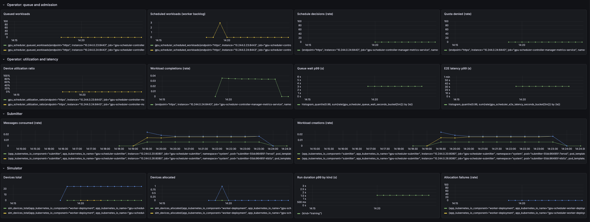
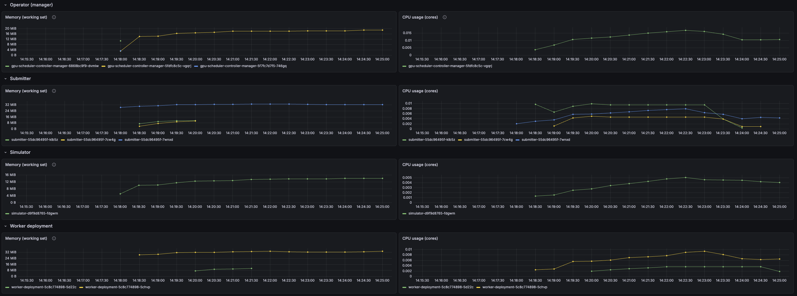

# Scale and non-functional demo results

This document covers **non-functional** (performance/scale) resource estimation, caps, scaling plan, and baseline demo results. For scaling strategy (which stage to scale on), see [README](../README.md).

---

## 1. Resource estimation (e.g. 8G Docker node)

On a **memory-constrained** node (e.g. **8 GB** total for Docker or a single VM), you must **cap resources** per component so the full stack fits and does not OOM when scaling. Set limits (and requests) **before** increasing replicas or load.

### 1.1 Ballpark usage per component

| Component | Typical use | Suggested cap (8G node) | Notes |
|-----------|-------------|-------------------------|--------|
| **Kind / control plane** | 500Mi–1Gi | 1Gi limit | etcd + API server + core pods. Leave headroom. |
| **Strimzi / Kafka** | 1–2Gi | 1.5Gi total (operator + broker) | Single broker + Kafka Exporter; reduce heap if needed. |
| **Operator (manager)** | 200–500Mi per pod | 512Mi limit per pod | One pod is leader (scheduler loop + reconcilers); extra replicas are non-leaders (reconcilers only). Same container, so same cap per replica. Scaling adds actuation throughput, not scheduler throughput. |
| **Submitter** | 50–150Mi per replica | 128Mi limit per pod | Scale replicas; each is a Kafka consumer. |
| **Simulator** | 50–100Mi | 128Mi limit | In-memory state; low unless many runs. |
| **Worker deployment** | 50–100Mi per replica | 128Mi limit per pod | Scale on Scheduled backlog. |
| **KEDA** | 200–500Mi | 256Mi per component (operator + metricServer); **512Mi total** | Scaler controller. |
| **System / buffer** | — | ~1Gi reserved | OS, Docker, eviction buffer. |

**Rough total (minimal, 1 replica each):** ~1 (Kind) + 1.5 (Kafka) + 0.5 (1 operator pod) + 0.15 (1 submitter) + 0.15 (1 worker) + 0.13 (simulator) + 0.5 (KEDA: operator + metricServer) + 1 (buffer) ≈ **5.25 Gi**. That leaves ~**2.75 Gi** for **scaling**: more submitter replicas, more worker replicas, more operator replicas (reconciler capacity), or higher limits under load.

**Where each pipeline component’s caps are set:** All of the following are part of the end-to-end pipeline; caps are applied in-repo where we control the manifest, or via the install flow.

| Component | Where the cap is set |
|-----------|----------------------|
| **Kind / control plane** | No in-repo manifest. Give the Kind node enough memory (e.g. Docker Desktop or VM = 8G). Control plane (etcd, API server, core pods) shares that; the ~1Gi figure is the share to keep in mind when sizing the node. |
| **Strimzi / Kafka** | `deploy/kafka/cluster.yaml`: broker resources on `KafkaNodePool.spec.resources`, Kafka Exporter on `spec.kafkaExporter.resources`. Strimzi operator is installed via Helm separately; size its node or adjust operator Helm values if you need to cap it. |
| **Operator (manager)** | `config/manager/manager.yaml`: `containers[].resources` (512Mi limit per pod). |
| **Submitter** | `deploy/submitter/deployment.yaml`: `containers[].resources` (128Mi limit per pod). |
| **Simulator** | `deploy/simulator/deployment.yaml`: `containers[].resources` (128Mi limit). |
| **Worker deployment** | `deploy/worker-deployment/deployment.yaml`: `containers[].resources` (128Mi limit per pod). |
| **KEDA** | `deploy/keda/values.yaml`: `resources.operator` and `resources.metricServer` (256Mi limit). Applied when you run `make keda-up` (Makefile passes `-f deploy/keda/values.yaml` to Helm). |

**Max scaling (if the entire ~2.75 Gi scaling budget is used for one component; caps above):**

| Component | Max replicas / partitions | Calculation |
|-----------|---------------------------|-------------|
| **Submitter** | **22** replicas | 2816 Mi ÷ 128 Mi/pod ≈ 22. |
| **Kafka partitions** (submit topic) | **22** | Match consumer count so each submitter can consume from one partition; 22 partitions supports up to 22 submitter replicas. |
| **Operator (reconciler)** | **6** total (1 leader + **5** non-leaders) | 2816 Mi ÷ 512 Mi/pod ≈ 5 extra pods; baseline already has 1 leader. |
| **Worker** | **22** replicas | 2816 Mi ÷ 128 Mi/pod ≈ 22. |

The 2.75 Gi budget is **shared**. Running all components at these maxima at once would exceed 8G (e.g. 22×128 + 22×128 + 5×512 ≈ 8.5 Gi for submitters + workers + extra operator pods alone). In practice, scale one stage at a time or split the budget across stages.

### 1.2 Memory and CPU metrics to track

When scaling out, track **memory and CPU per component** so you can see when usage is nearing the caps above. Each of the following exposes Prometheus metrics on its `/metrics` endpoint; scrape them and compare to the limits in the table.

| Component | Metrics (Prometheus) | Cap to compare against |
|-----------|----------------------|-------------------------|
| **Operator (manager)** | `process_resident_memory_bytes`, `process_cpu_seconds_total` (and `go_*` runtime) | 512Mi memory per pod |
| **Submitter** | Same | 128Mi per pod |
| **Simulator** | Same | 128Mi |
| **Worker deployment** | Same (metrics on `:8080`, set `METRICS_BIND_ADDRESS` to override) | 128Mi per pod |

- **Memory:** `process_resident_memory_bytes` is the process RSS; compare to your `resources.limits.memory` (e.g. 128Mi = 134217728 bytes). Alert or back off scaling when usage approaches the limit.
- **CPU:** `process_cpu_seconds_total` is cumulative; use `rate(process_cpu_seconds_total[5m])` to get CPU usage per second and compare to the container limit.

Kubernetes also exposes **container** metrics (e.g. `container_memory_working_set_bytes`, `container_cpu_usage_seconds_total`) via kubelet/cAdvisor; you can use those instead of or in addition to process metrics, with the same comparison to the caps above.

---

## 2. Scaling plan (bottleneck to bottleneck, left to right)

Scale **left to right** along the pipeline so each stage is not the limiter before the next. Start each stage at or near its max (within the shared scaling budget), then **watch the downstream metric** for the next stage. If that metric is suffering, **reduce** the current stage's replicas until the downstream metric is healthy; that gives you the sustainable size for the current stage.

| Stage (left → right) | Start at | Downstream metric to watch | If downstream suffers → reduce |
|----------------------|----------|----------------------------|-------------------------------|
| **1. Ingestion** (Submitter + partitions) | 22 partitions, 22 submitter replicas | **`gpu_scheduler_queued_workloads`** (queue depth); **`gpu_scheduler_queue_wait_seconds`** (p99 admission latency). | Queue depth grows or admission latency stays high → the single scheduler leader can't keep up. **Reduce submitter replicas** (and partitions to match) until queue depth stabilizes and p99 wait time is acceptable. |
| **2. Reconciliation** (Operator replicas) | 6 total (1 leader + 5 non-leaders) | **`gpu_scheduler_scheduled_workloads`** (backlog of admitted, not yet running). | If scheduled backlog stays high while workers are at max, execution is the bottleneck (scale workers, not reconcilers). If scheduled backlog stays low at high load, **reduce operator replicas** until backlog or reconciliation delay appears—that is the minimum reconcilers needed. |
| **3. Execution** (Workers) | 22 worker replicas | **`gpu_scheduler_scheduled_workloads`** (should drain as workers run workloads); completion rate. | If scheduled backlog is high and workers are maxed, you're execution-bound. **Reduce worker replicas** only when backlog stays low (workers underutilized) until backlog starts to grow—that is the minimum workers for the load. |

**Order of operations:** Ramp ingestion to max (22/22); if queue depth or queue wait explodes, scale submitters (and partitions) down until those metrics are good. Then ramp operator replicas; if scheduled backlog grows and workers are busy, add workers (or accept execution as bottleneck). Then set workers; if scheduled backlog is low, reduce workers until it starts to grow. The first stage where reducing replicas makes a downstream metric worse is the current bottleneck.

---

## 3. Baseline demo (metrics and E2E at low load)

### 3.1 Setup and run

```bash
make stack-up
kubectl port-forward -n monitoring svc/kube-prometheus-stack-grafana 3000:80
kubectl port-forward -n kafka pod/kafka-dual-role-0 9092:9094
# Configure Grafana: add Prometheus datasource, import pipeline and resources dashboards (see contributor-workflow.md)
make run-producer ARGS="-brokers=localhost:9092 -config=config/demo/contention-10-workloads.json -burst"
./scripts/demo-capture.sh demo-run.log config/demo/contention-10-workloads.json
```

Teardown: `make stack-down-fast`. For details (Grafana URL/login, datasource URL, optional watch), see [Contributor workflow: Baseline demo](contributor-workflow.md#baseline-demo-deploy-stack-grafana-and-producer).

### 3.2 Observations from capture (demo-run.log)

Run captured 10 workloads (contention-wl-1 … contention-wl-10) from `config/demo/contention-10-workloads.json` in namespace `default`. All 10 reached **Succeeded**; the script reported "All expected workloads are in a terminal phase (Succeeded/Failed)" and completed in ~2s (workloads had already finished before the first poll).

**FINAL GPUWorkloads (from log):** contention-wl-1 through contention-wl-10, all Succeeded; ages 45s–51s.

**Events:** Queued (gpuworkload-controller) and Admitted (scheduler-loop) events present for all 10 workloads.

**Operator:** Manager started, metrics on :8443, leader lease acquired. GPUNodePool fleet registered in simulator (gpunodepool-a100, gpunodepool-sample, gpunodepool-tpu-v5e). Workloads queued and admitted in order; no panics in the captured tail.

**Submitter:** Logs show "Created GPUWorkload" (e.g. contention-wl-3, contention-wl-6); three submitter pods found; consumed from Kafka and created CRs as expected.

**Worker:** Worker pods started, polling namespace default for Phase=Scheduled every 5s; two worker pods found; no errors in the captured tail.

**Simulator:** No errors in the captured tail; demo capture completed in 2s.

### 3.3 Grafana dashboard screenshots

Pipeline and resources dashboards from `raw_data/baseline_demo/screenshots/`:





### 3.4 CSV / data analysis

Data from `raw_data/baseline_demo/csv_data/` for the 10-workload baseline: **E2E latency (submit → Succeeded) p99 ≈ 31.7 s**; **queue wait p99 ≈ 3.11 s**; run duration p99 (training) ≈ 1.59 s. Completion rate ~0.034/s; scheduled backlog briefly 3 then 0; queued 0; allocation failures 0. Operator memory ~19 MiB, worker memory ~33 MiB (both well under caps). Utilization 0% (burst of 10 then idle).
