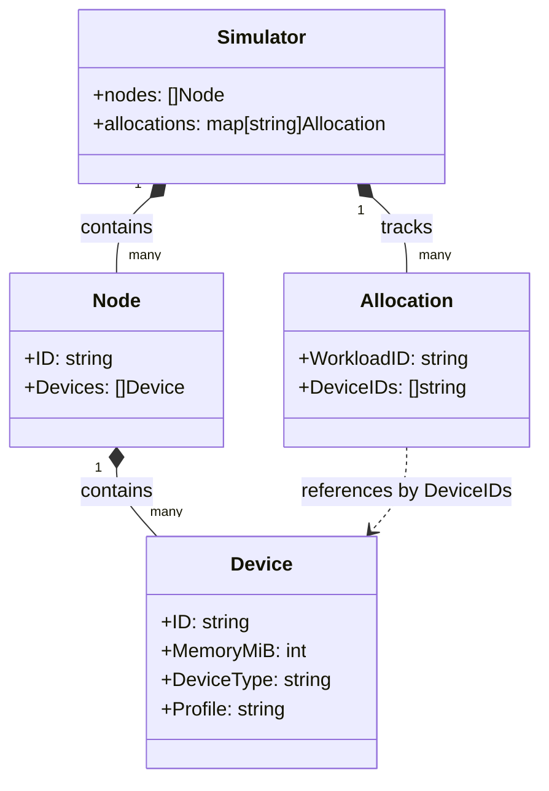
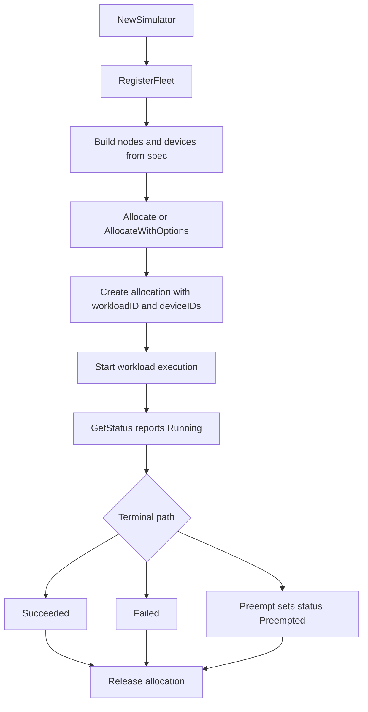

# `internal/sim` Model and Lifecycle

This package implements an instance-based simulator API around `Simulator`.

## Model Hierarchy

### What this means
- A `Simulator` instance owns one in-memory fleet (`nodes`) and active `allocations`.
- Each `Node` contains multiple `Device`s.
- `Allocation` stores selected device IDs for a workload.

## Lifecycle Flow

### Lifecycle notes
- `RegisterFleet` initializes/upserts the logical fleet from spec.
- `Allocate` picks free eligible devices according to placement policy and constraints.
- `Start` begins simulated execution; `GetStatus` is polled for transitions.
- `Preempt` interrupts a running workload.
- `Release` frees the workload allocation so devices return to the pool.

## Allocation placement policies

Device IDs are named like `"node-0/gpu-0"`, `"node-0/gpu-1"`, etc. See `buildNodes` for the exact naming.
Assume a fleet with 3 nodes and 4 devices each (`node-0..2`, `gpu-0..3`) and we request 5 GPUs.

- **`first_fit`**
  - **How it works**: iterate nodes in order and take the first eligible devices until satisfied.
  - **Example**: `["node-0/gpu-0","node-0/gpu-1","node-0/gpu-2","node-0/gpu-3","node-1/gpu-0"]`

- **`pack`**
  - **How it works**: sort nodes by *how many eligible devices they currently have* (descending), then apply `first_fit` on that sorted order.
  - **Example**: if `node-1` has 4 free devices, `node-2` has 3, `node-0` has 1, a 5-GPU pack result is
    `["node-1/gpu-0","node-1/gpu-1","node-1/gpu-2","node-1/gpu-3","node-2/gpu-1"]`

- **`spread`**
  - **How it works**: round-robin across nodes, taking one eligible device per node per “pass”.
  - **Example**: `["node-0/gpu-0","node-1/gpu-0","node-2/gpu-0","node-0/gpu-1","node-1/gpu-1"]`

- **`locality_aware`**
  - **How it works**: prefer a single-node allocation *if any node can satisfy the entire request*; otherwise fall back to `pack`.
  - **Example (single-node possible)**: requesting 3 GPUs yields `["node-0/gpu-0","node-0/gpu-1","node-0/gpu-2"]`
  - **Example (single-node not possible)**: requesting 5 GPUs falls back to the same behavior as `pack`.

## Minimal hardware profile fields

To keep profile modeling simple but useful for scheduling/runtime simulation, this package uses a minimal hardware profile schema:
The canonical profile data lives in `configs/hardware_profiles.yaml` and is mirrored to `internal/sim/hardware_profiles.json`.

- `name` (required): stable profile identifier (for example, `h100_sxm`).
- `memoryMiB` (required): on-device memory capacity used by fit checks.
- `memBandwidthGBps` (required): memory bandwidth used for runtime calibration.
- `peakTFLOPSBF16` (optional): BF16 peak compute throughput for richer compute-bound modeling.
- `interconnectGBps` (optional): interconnect bandwidth for multi-device scaling realism.
  - For 1-GPU jobs, this usually matters less.
  - For multi-GPU jobs (especially training), GPUs sync frequently; slower interconnect means more waiting and longer runtimes.
- `notes` (required): assumptions/context for the profile entry.
- `source_url` (required): canonical vendor source URL.
- `source_urls` (required in curated profiles): supporting official source links used to ground profile values.

## Why these metrics matter

- Capacity (`memoryMiB`) controls whether a workload can be admitted at all.
- Bandwidth (`memBandwidthGBps`) impacts how quickly large tensors/tokens can be moved through memory.
- Compute (`peakTFLOPSBF16`) helps model compute-bound portions of runtime.
- Interconnect (`interconnectGBps`) matters when multiple devices synchronize (for example data/model parallel training).
- Source links make assumptions auditable and easy to refresh when vendor specs change.

## Runtime model overview

Runtime estimation is driven by `estimateDuration` and starts from a baseline profile throughput table (`profileTokensPerSecond`), then applies bounded multipliers.

High-level shape:

- baseline throughput from profile + allocated device count
- hardware-profile adjustment using `memBandwidthGBps`, optional `peakTFLOPSBF16`, and optional `interconnectGBps` (multi-device only)
- workload-kind-specific gains/penalties (batching, sequence length, overheads, stage factors)
- optional jitter when enabled

Conceptually:

- `effectiveTPS = baselineTPS(profile) * deviceCount * hardwareFactor * kindThroughputFactors`
- `seconds = tokens / effectiveTPS`
- `seconds *= kindPenaltyFactors`
- `seconds = applyJitter(seconds)` when `jitter.enabled=true`
- final runtime is rounded up to whole seconds with a 1-second minimum

### Supported workload kinds and factors

- **`training`**
  - Global vs micro-batch scaling and gradient accumulation effects.
  - Sequence-length penalty (longer sequences increase runtime).

- **`inference`**
  - Batch-size efficiency curve with diminishing returns.

- **`eval`**
  - Eval batch-size efficiency curve.
  - Optional metric and validation overhead percentages.

- **`fine_tune`**
  - Global/micro-batch and gradient accumulation effects (with slightly more conservative scaling than training).
  - Optional warm-start/checkpoint load overhead percentages.

- **`rlhf`**
  - Multi-stage factor combining rollout, reward-scoring, and policy-update costs.
  - Batch and update-step knobs per stage.

- **`embedding`**
  - Embedding batch-size efficiency curve.
  - Vector-dimension and average token-length scaling.

- **`data_preprocess`**
  - Input-bytes throughput scaling model.
  - Optional tokenization and augmentation overhead percentages.

- **`distillation`**
  - Teacher forward-pass overhead.
  - Teacher-profile influence (relative teacher vs student profile throughput).

Notes:

- Multipliers are intentionally bounded to keep simulation behavior stable and avoid unrealistic swings.
- This is a first-order model intended for scheduler/control-plane realism; constants can be recalibrated as benchmark data accumulates.

## Current profile source links

### `h100_sxm`

- https://www.nvidia.com/en-us/data-center/h100/
- https://resources.nvidia.com/en-us-tensor-core/nvidia-tensor-core-gpu-datasheet

### `a100_80gb`

- https://www.nvidia.com/en-us/data-center/a100/
- https://www.nvidia.com/content/dam/en-zz/Solutions/Data-Center/a100/pdf/nvidia-a100-datasheet-us-nvidia-1758950-r4-web.pdf

### `tpu_v5e_chip`

- https://cloud.google.com/tpu/docs/v5e

### `trn1_instance`

- https://aws.amazon.com/ec2/instance-types/trn1/
- https://aws.amazon.com/machine-learning/trainium/
